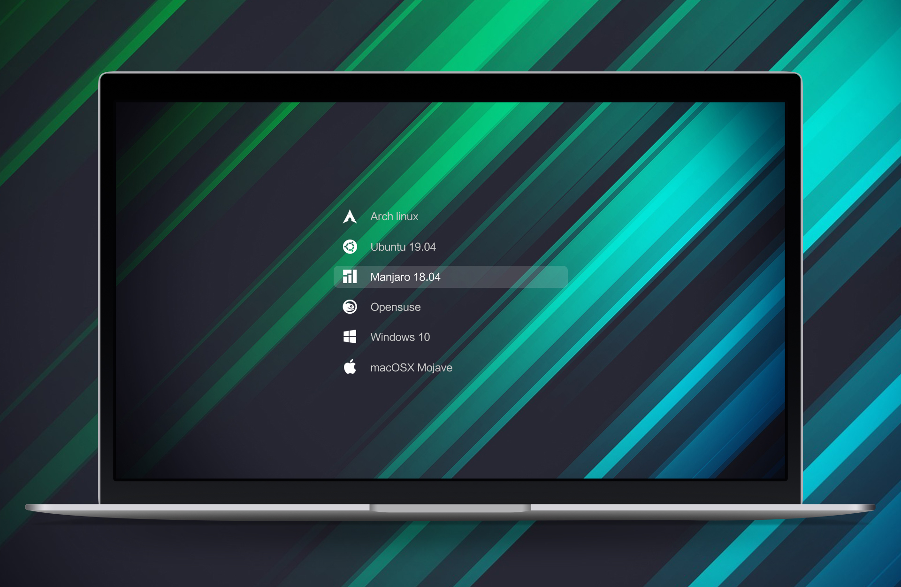
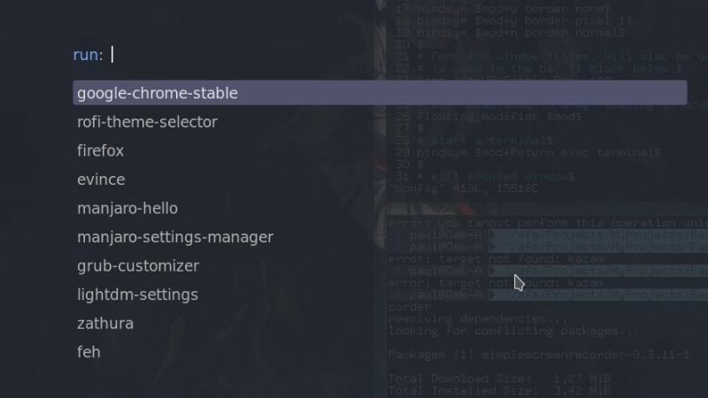
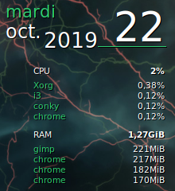

# Dotfiles-Conf
Some dotfiles and configuration files

## Dotfiles

### Urxvt - term

Create .Xdefaults file and put your own customization.
Transparency :
`urxvt*depth: 32`
`urxvt*background: rgba:0000/0000/0200/c800`

## Configs

### .i3/config

- Modify gaps between elements :
    - `gaps inner x` : change all gaps
    - `gaps outer x` : change only outer gaps

### Grub custom

- Install grub-customizer by typing `sudo pacman -S grub-customizer`
    Then customize os list, timeout, etc.
- Modify theme : https://github.com/vinceliuice/grub2-themes

### Rofi custom - dmenu

- Install Rofi by typing `sudo pacman -S rofi`
- Rofi's github : https://github.com/davatorium/rofi
- If you want to add more themes : https://github.com/davatorium/rofi-themes
    cpy \*.rasi files into /usr/share/rofi/themes
- Use the Rofi's Wiki at : https://github.com/davatorium/rofi/wiki
- Modify theme : https://github.com/davatorium/rofi/wiki/themes,
    do 2 the commands explained in the link
- Go on rofi-theme-selector and choose your theme, validate by pressing
    <kbd>Alt</kbd> + <kbd>A</kbd>

### Conky

- Use green conky instead of maia : in .i3/config file, comment the line
`# exec --no-startup-id start_conky_maia` and add
`exec --no-startup-id start_conky_green`
- Remove the help shortcuts : in /bin/start_conky_green file, comment this line
`conky -c /usr/share/conky/conky1.10_shortcuts_green &&`

## Others

### Nitrogen

Use it in order to change the wallpaper

### Lightdm

Use lightdm-settings to change the login screen
